# 🩺 Virtual Patient English — Klinik Ingliz Tili Muloqot Platformasi

<p align="center">
  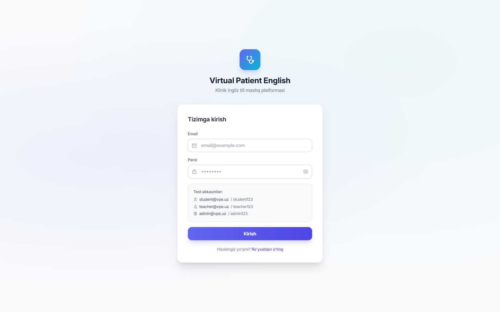
</p>

<p align="center">
  
  
  
  
  
  
  
  
  
</p>

---

## 📌 Loyiha Haqida (Project Overview)

**Virtual Patient English** — tibbiyot va stomatologiya oliy ta'lim muassasalari talabalari uchun yaratilgan, sun'iy intellekt (Google Gemini AI / OpenAI) asosidagi **interaktiv klinik ingliz tili muloqot simulyatori**.

Platforma talabalarga haqiqiy xorijiy bemorlar bilan xavfsiz, virtual muhitda muloqot qilish, kasallik tarixini to'plash (anamnez), klinik etika me'yorlariga rioya etish va kasbiy leksikani amaliyotda qo'llash imkonini beradi. Har bir simulyatsiya yakunida AI talabaning grammatikasi, tibbiy terminologiyasi, ravonligi, talaffuzi va klinik etikasini 100 ballik shkala bo'yicha ko'p omilli baholaydi.

---

## 🚀 Asosiy Imkoniyatlar (Key Features)

### 👨‍🎓 1. Talaba Portali (Student Portal)
- **10 ta Stomatologik Modul**: Har biri alohida klinik holat, shikoyatlar va anamnezga ega ssenariylar.
- **6 Bosqichli 90 Daqiqalik O'quv Sikli**:
  1. 📖 **Vocabulary**: Audio talaffuz va o'zbekcha tarjimali maxsus tibbiy atamalar.
  2. 💬 **Smart Phrasebook**: Anamnez olish, tekshirish va tavsiya berish uchun shpargalka iboralar.
  3. 🤖 **Virtual Patient Chat**: AI virtual bemor bilan matnli va ovozli real-vaqt muloqoti.
  4. 📊 **AI Evaluation & Feedback**: Grammatika, atamalar, etika va xatolar bo'yicha ko'p faktorli batafsil tahlil.
  5. 🔄 **Practice Retry**: Qilingan xatolarni inobatga olgan holda simulyatsiyani qayta topshirish.
  6. 🎯 **Final Challenge / Test**: Modul bo'yicha yakuniy bilimni baholash testi.
- **Ovozli Chat (Voice STT / TTS)**: Web Speech API va Web Audio yordamida real ovozli suhbat.
- **Klinik Grammatika Tekshiruvchisi (Grammar Checker)**: Matnlarni tibbiy uslub va grammatik to'g'rilik bo'yicha tahlil qilish.
- **Klinik Forum (Peer Discussion)**: Talabalar va ustozlar o'rtasida keyslar muhokamasi.
- **Shaxsiy Profil & Radar Tahlili**: Barcha modullar bo'yicha o'zlashtirish statistikasi va ballar tarixi.

### 👩‍🏫 2. O'qituvchi Portali (Teacher Portal)
- **Guruhlar Statistikasi**: O'qituvchiga biriktirilgan guruhlar va talabalar ro'yxati.
- **Natijalar Monitoringi**: Talabalarning har bir modul bo'yicha olgan ballari va urinishlar soni.
- **Excel Hisoboti**: Natijalarni bir marta bosish orqali Excel formatida yuklab olish.
- **Kamchiliklar Tahlili**: Guruh miqyosida ko'p uchrayotgan grammatik va klinik xatolar bo'yicha xulosa.

### 👨‍💼 3. Administrator Portali (Admin Portal)
- **Tizim Umumiy Ko'rsatkichlari**: Faol foydalanuvchilar, modullar va urinishlar soni tahlili.
- **Foydalanuvchilar Boshqaruvi (Users CRUD)**: Student, Teacher va Admin rollarini yaratish, tahrirlash va guruhlarga taqsimlash.
- **Guruhlar & Yo'nalishlar (Groups & Specialties)**: Kafedralar, yo'nalishlar va guruhlarni boshqarish hamda o'qituvchi-talabalarni biriktirish.
- **Interaktiv Kontent Menejeri (Content Manager)**: Modullar, terminlar, iboralar, test savollari va virtual bemor promptlarini to'g'ridan-to'g'ri interfeys orqali boshqarish.

---

## 🦷 10 ta Stomatologik O'quv Modullari

| № | Modul Nomi | Klinik Ssenariy | Asosiy Leksika |
|---|:---|:---|:---|
| **01** | **Dental Pain Assessment** | O'tkir tish og'rig'i, davomiyligi va triggerlarini aniqlash | *Throbbing, radiating, sensitivity, percussion* |
| **02** | **Caries & Restorative Care** | Karies diagnostikasi va plomba variantlarini tushuntirish | *Enamel, composite, filling, restorative* |
| **03** | **Periodontal Evaluation** | Milklarning qonashi, gingivit va paradontit tekshiruvi | *Bleeding on probing, plaque, calculus, pocket depth* |
| **04** | **Tooth Extraction & Surgery** | Tish oldirishga tayyorgarlik va behushlik qilish | *Extraction, local anesthesia, forceps, elevator* |
| **05** | **Dental Abscess & Infection** | Yiringli yallig'lanish, shish va antibiotik terapiyasi | *Swelling, drainage, infection, antibiotics* |
| **06** | **Orthodontic Consultation** | Tish qatorini to'g'rilash va breketlar bo'yicha konsultatsiya | *Malocclusion, braces, aligners, crowding* |
| **07** | **Prosthodontics & Crowns** | Protezlash, toj qoplamalar va ko'priksimon protezlar | *Crown, bridge, abutment, impression* |
| **08** | **Dental Trauma & Emergency** | Shikastlangan tishlar, travma va shoshilinch yordam | *Subluxation, avulsion, splinting, trauma* |
| **09** | **Pediatric Dental Patient** | Bolalar bilan muloqot va ota-onaga gigiyena tavsiyalari | *Primary teeth, fissure sealant, dental phobia* |
| **10** | **Post-Operative Care** | Operatsiyadan keyingi parvarish va asoratlarni oldini olish | *Dry socket, gauze, ice pack, soft diet* |

---

## 🔄 6 Bosqichli Klinik O'quv Sikli

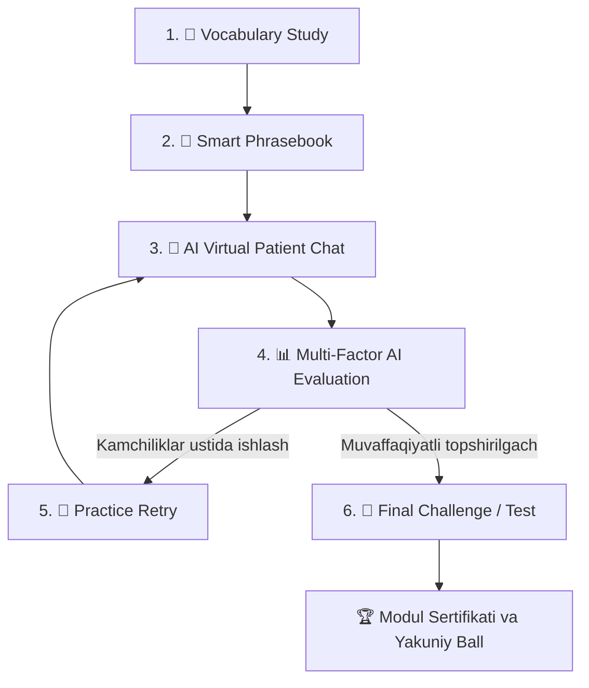

---

## 🧠 AI Baholash Matritsasi (Evaluation Matrix)

AI har bir suhbatni quyidagi 5 parametr bo'yicha chuqur tahlil qilib, **JSON schema** asosida tuzilgan natija beradi:

$$\text{Umumiy Ball (100)} = \text{Grammar (25)} + \text{Vocabulary (25)} + \text{Fluency (20)} + \text{Ethics (15)} + \text{Clinical Relevance (15)}$$

```json
{
  "totalScore": 88,
  "metrics": {
    "grammar": 22,
    "vocabulary": 23,
    "fluency": 18,
    "ethics": 13,
    "clinicalRelevance": 12
  },
  "strengths": [
    "Used accurate diagnostic terminology (e.g. 'percussion test', 'radiating pain').",
    "Empathetic tone while addressing severe discomfort."
  ],
  "weaknesses": [
    "Used past continuous instead of present perfect when inquiring about pain duration.",
    "Missed asking about drug allergies before suggesting pain relief."
  ],
  "corrections": [
    {
      "original": "How long time you having this pain?",
      "suggested": "How long have you been experiencing this pain?",
      "explanation": "Use present perfect continuous for ongoing symptoms."
    }
  ]
}
```

---

## 📸 Skrinshotlar Galereyasi (Screenshots)

### 🔐 Tizimga Kirish va Talaba Portali
| Kirish Sahifasi | Talaba Boshqaruv Paneli |
| :---: | :---: |
|  | 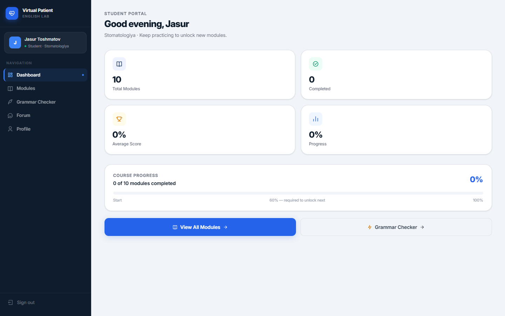 |

| 10 ta Stomatologik Modul | Virtual Bemor Simulyatori |
| :---: | :---: |
| 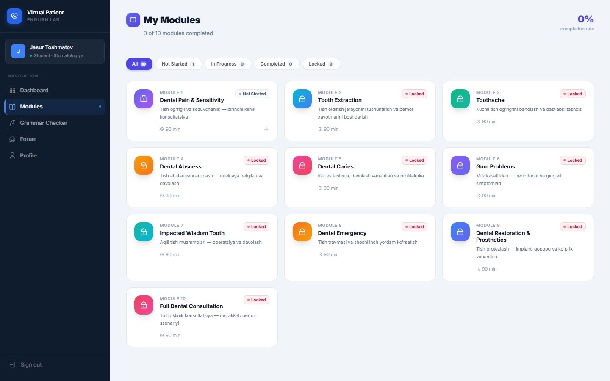 | 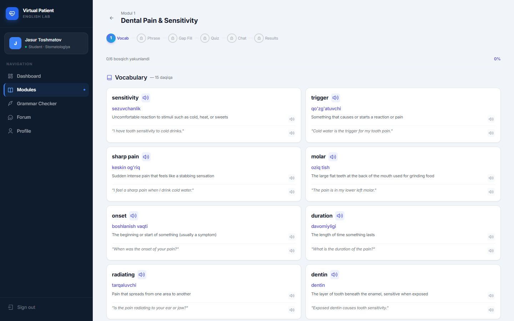 |

| Grammatika Tekshiruvi | Talaba Profili & Statistikasi |
| :---: | :---: |
| 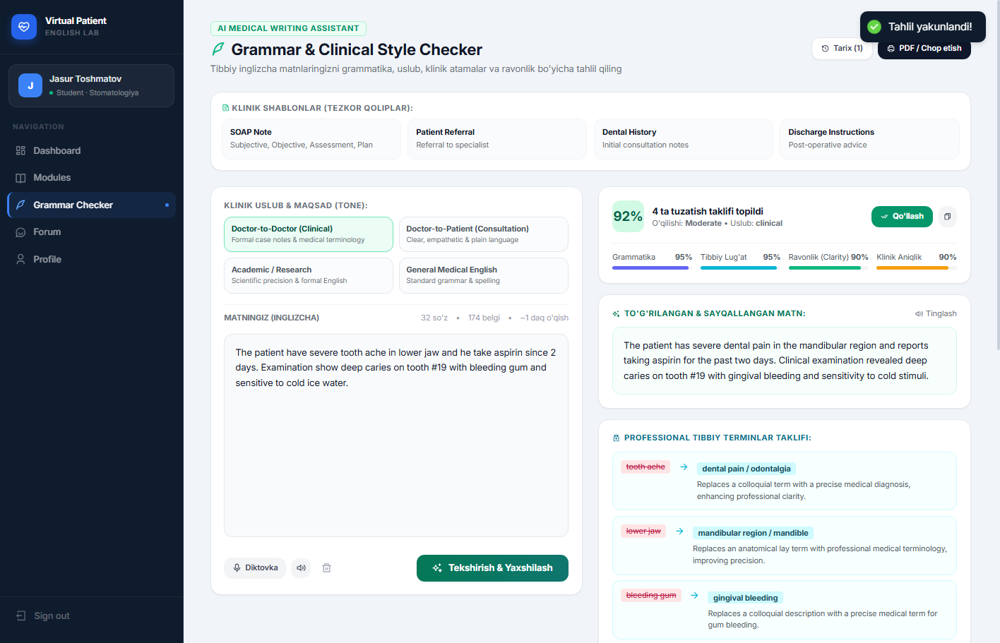 | 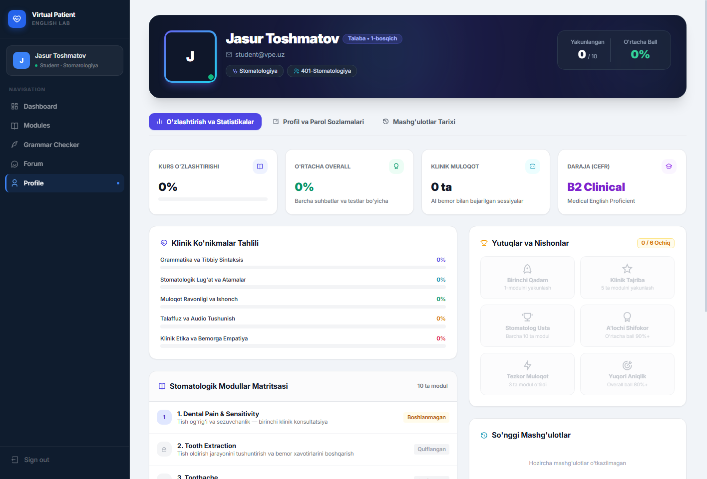 |

---

### 👩‍🏫 O'qituvchi va 👨‍💼 Admin Portallari
| O'qituvchi Hisobotlari | Admin Foydalanuvchilar Boshqaruvi |
| :---: | :---: |
| 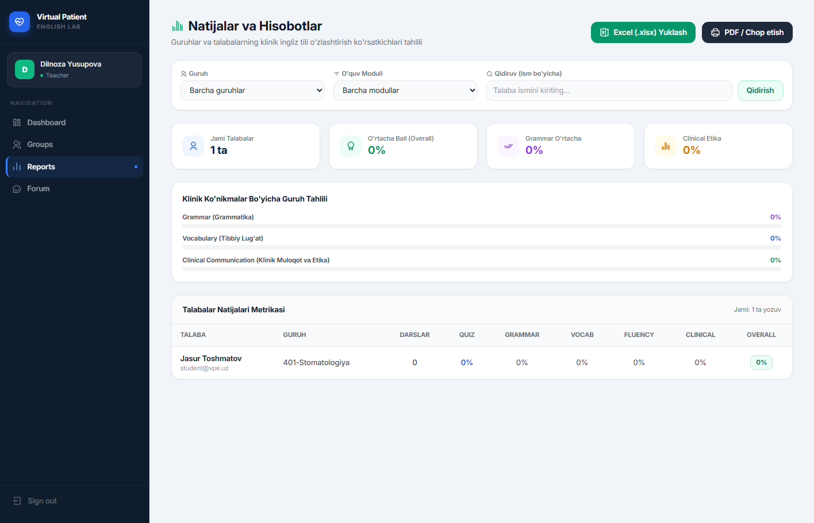 | 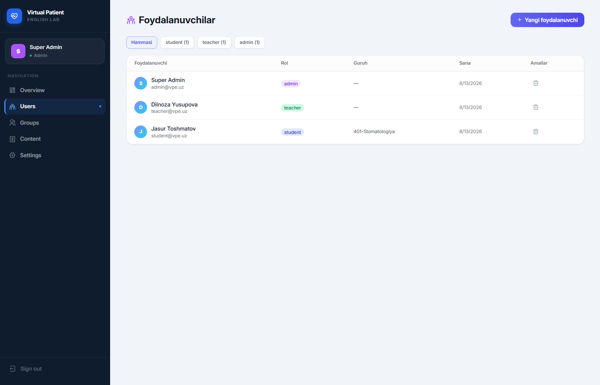 |

| Admin Guruhlar Taqsimoti | Admin Interaktiv Kontent Menejeri |
| :---: | :---: |
| 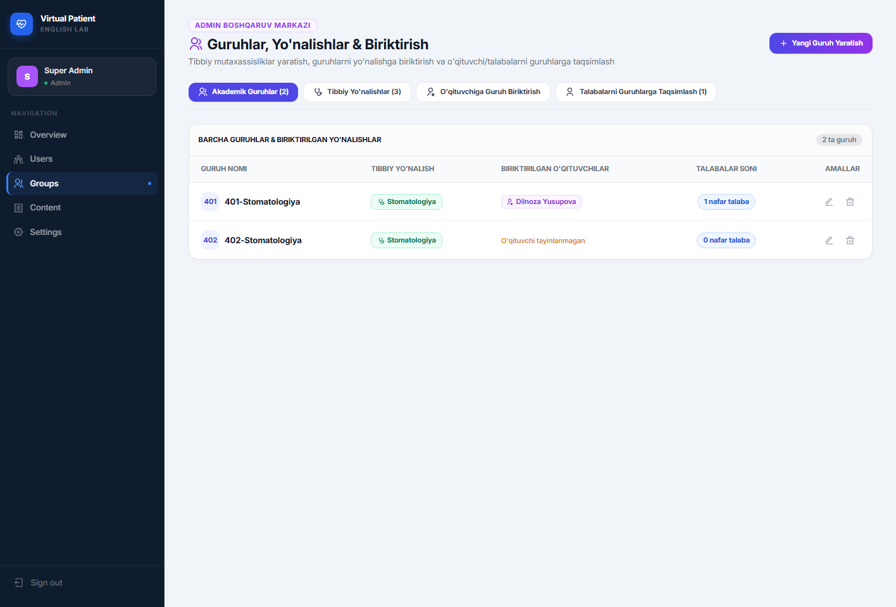 | 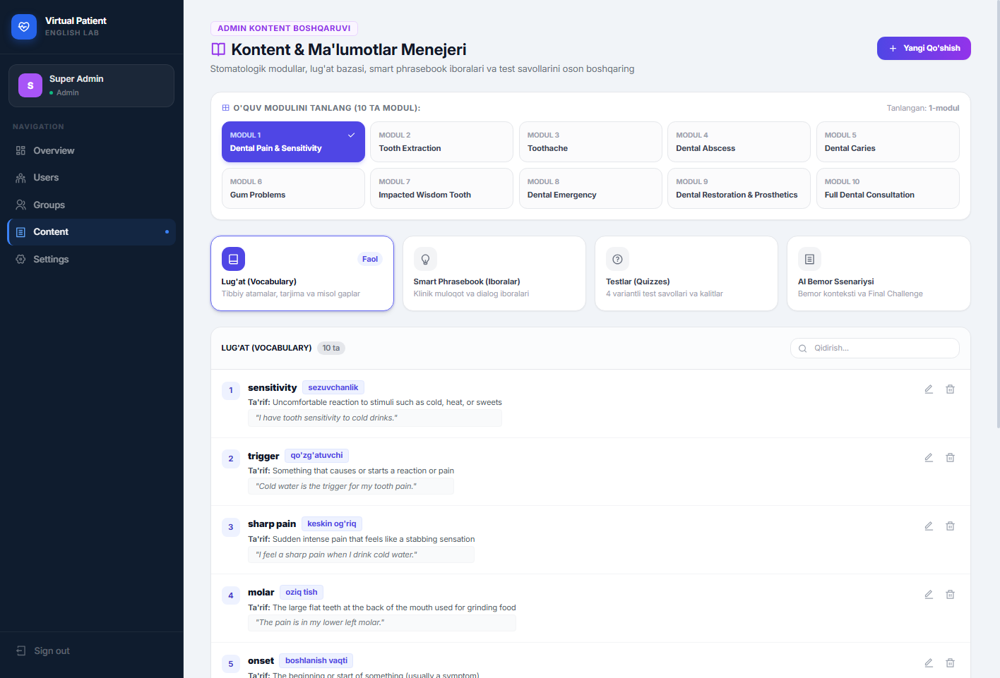 |

---

## 🛠 Texnologiyalar Steki (Tech Stack)

### Frontend
- **React 19** — Zamonaviy komponent arxitekturasi va Hooklar
- **Vite 6** — Yuqori tezlikdagi frontend build va dev tool
- **Tailwind CSS v4** — Moslashuvchan va chiroyli dizayn tizimi
- **React Router DOM v7** — Xavfsiz marshrutlash va rollarga asoslangan yo'naltirish
- **React Icons (Remix Icons)** — Tibbiyot va boshqaruv piktogrammalari
- **React Hot Toast** — Bildirishnomalar va xatoliklar boshqaruvi
- **Web Speech API & MediaRecorder** — Nutqni aniqlash (STT) va ovozli eshittirish (TTS)

### Backend
- **Node.js (v20+) & Express.js** — REST API server
- **Sequelize ORM** — MySQL relyatsion ma'lumotlar bazasi boshqaruvi
- **MySQL 8.0+** — Tezkor va ishonchli relyatsion DB
- **JWT (JSON Web Token) & bcryptjs** — Xavfsiz autentifikatsiya va parollarni shifrlash
- **Helmet & CORS** — Veb xavfsizlik himoya choralari
- **Google GenAI SDK (Gemini)** — Virtual bemor simulyatsiyasi va baholash mexanizmi

---

## 📚 Tizim Hujjatlari Xaritasi (System Documentation)

Barcha batafsil texnik va pedagogik qo'llanmalar [`docs/system/`](./docs/system/) jildida saqlanadi:

| № | Hujjat | Tavsif |
|---|:---|:---|
| 01 | [`01_overview.md`](./docs/system/01_overview.md) | Tizim arxitekturasi, asosiy maqsad va texnologiyalar |
| 02 | [`02_roles.md`](./docs/system/02_roles.md) | Foydalanuvchi rollari huquqlari (Student, Teacher, Admin) |
| 03 | [`03_menus.md`](./docs/system/03_menus.md) | Sahifalar ierarxiyasi va navigatsiya tuzilmasi |
| 04 | [`04_database.md`](./docs/system/04_database.md) | MySQL jadvallari, indekslar va Sequelize modellari |
| 05 | [`05_api_endpoints.md`](./docs/system/05_api_endpoints.md) | REST API marshrutlari, parametrlar va status kodlar |
| 06 | [`06_ai_integration.md`](./docs/system/06_ai_integration.md) | Gemini AI ulanishi, tizim promptlari va JSON formatlari |
| 07 | [`07_frontend_architecture.md`](./docs/system/07_frontend_architecture.md) | React komponentlar tuzilmasi va holat boshqaruvi |
| 08 | [`08_modules_and_content.md`](./docs/system/08_modules_and_content.md) | Stomatologik modullar kontenti va ma'lumotlar strukturasi |
| 09 | [`09_security_and_auth.md`](./docs/system/09_security_and_auth.md) | JWT, bcrypt, CORS, Role guards va xavfsizlik himoyasi |
| 10 | [`10_deployment_and_setup.md`](./docs/system/10_deployment_and_setup.md) | Nginx, PM2, SSL sertifikati va ishlab chiqarish konfiguratsiyasi |
| 11 | [`11_admin_panel_functions.md`](./docs/system/11_admin_panel_functions.md) | Admin paneli funksiyalari, foydalanuvchilar va kontent menejeri |
| 12 | [`12_curriculum_and_10_dental_modules.md`](./docs/system/12_curriculum_and_10_dental_modules.md) | 10 ta stomatologik modulning to'liq klinik o'quv dasturi |
| 13 | [`13_90_minute_pedagogical_cycle.md`](./docs/system/13_90_minute_pedagogical_cycle.md) | 6 bosqichli dars sikli va vaqt taqsimoti |
| 14 | [`14_speech_and_voice_processing.md`](./docs/system/14_speech_and_voice_processing.md) | Ovozli muloqot, nutqni matnga o'girish (STT) va TTS texnologiyalari |
| 15 | [`15_business_pricing_and_roadmap.md`](./docs/system/15_business_pricing_and_roadmap.md) | Tijorat paketlari, narxlar va rivojlanish rejasi |
| 16 | [`16_ai_evaluation_matrix_and_prompt_engineering.md`](./docs/system/16_ai_evaluation_matrix_and_prompt_engineering.md) | AI prompt injiniringi va ko'p faktorli baholash rubrikalari |

---

## ⚡ Mahalliy O'rnatish va Ishga Tushirish (Quick Start)

### 1. Talablar (Prerequisites)
- **Node.js**: v18.0 yoki undan yuqori
- **MySQL**: 8.0+ (yoki XAMPP / Laragon / Community Server)
- **Google Gemini API Key**: [Google AI Studio](https://aistudio.google.com/) orqali olingan kalit

---

### 2. Repozitoriyani Klonlash
```bash
git clone https://github.com/muzaffarbekmustafayev/virtual-english-med-lab.git
cd virtual-english-med-lab
```

---

### 3. Backend Sozlash va Ishga Tushirish
```bash
cd backend
npm install

# .env faylini yarating va quyidagi o'zgaruvchilarni kiriting:
# PORT=5000
# DB_HOST=localhost
# DB_PORT=3306
# DB_USER=root
# DB_PASS=your_password
# DB_NAME=virtual_patient_db
# JWT_SECRET=your_super_jwt_secret_key_here
# GEMINI_API_KEY=your_gemini_api_key_here

# Ma'lumotlar bazasini yaratish va dastlabki ma'lumotlarni yuklash:
node create-db.js
npm run seed

# Serverni ishga tushirish (Development rejimi):
npm run dev
```

---

### 4. Frontend Sozlash va Ishga Tushirish
```bash
cd ../frontend
npm install

# Loyihani ishga tushirish:
npm run dev
```

Brauzeringizda quyidagi manzilni oching:  
👉 **`http://localhost:5173`**

---

## 🔑 Standart Test Akkauntlari (Default Seed Users)

| Rol | Email | Parol | Ruxsatlar |
|:---|:---|:---|:---|
| **Admin** | `admin@med.uz` | `admin123` | To'liq tizim boshqaruvi, foydalanuvchilar va kontent CRUD |
| **Teacher** | `teacher@med.uz` | `teacher123` | Guruhlar monitoringi, talabalar natijalari va Excel eksport |
| **Student** | `student@med.uz` | `student123` | 10 ta modul, AI suhbat, grammatika tekshiruvi va forum |

---

## 🌐 Production Deploy (Qisqa Qo'llanma)

1. **Frontend Build**:
   ```bash
   cd frontend
   npm run build
   ```
2. **Backend PM2 bilan doimiy ishga tushirish**:
   ```bash
   cd ../backend
   npm install -g pm2
   pm2 start src/server.js --name "virtual-med-backend"
   ```
3. **Nginx orqali teskari proksi (Reverse Proxy) va SSL (Certbot)** orqali xavfsiz ulanishni ta'minlang.

---

## 📄 Litsenziya va Muallif

- **Muallif:** [Mustafayev Muzaffarbek](https://github.com/muzaffarbekmustafayev)
- **Tashkilot:** Toshkent Davlat Stomatologiya Instituti / Virtual English Med Lab
- **Litsenziya:** [MIT License](LICENSE)

---
<p align="center">
  <b>Virtual Patient English</b> — Kelajak shifokorlarining xalqaro tibbiy muloqot ko'nikmalarini rivojlantirish platformasi! 🦷✨
</p>
