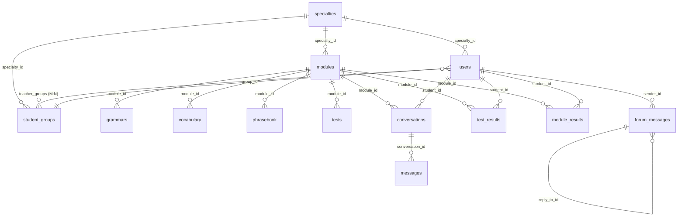

# Virtual Patient English — Ma'lumotlar Bazasi Sxemasi (MySQL)

## Umumiy Ma'lumot

Tizim **MySQL v8.0+** ma'lumotlar bazasida ishlaydi. Barcha jadvallar o'rtasida **Foreign Key** bog'liqliklar o'rnatilgan.

**ORM:** Sequelize v6.37+ (Node.js) — modellar va avtomatik sinxronizatsiya (`sequelize.sync()`) uchun.

> **Muhim:** Loyihada migratsiya fayllari ishlatilmaydi — jadvallar `sequelize.sync()` orqali modellardan avtomatik yaratiladi. Keyinchalik qo'shilgan **ustunlar** esa `src/services/schema.service.js` (`ensureColumns`) orqali server ishga tushganda va `node datas.js` bajarilganda `ADD COLUMN` bilan qo'shiladi (hech narsa o'chirilmaydi, `sync({ alter: true })` ishlatilmaydi).

### 2026-09 da qo'shilgan ustunlar (kontent konveyeri uchun)

| Jadval | Ustun | Tur | Maqsad |
|---|---|---|---|
| `specialties` | `code` | VARCHAR(30) | `GEN_MED` / `STOM` / `PED` / `NURSING` / `FIRST_AID` — `datas.json` bilan bog'lanish kaliti |
| `specialties` | `icon` | VARCHAR(10) | UI belgisi (🩺 🦷 👶 💉 🚑) |
| `specialties` | `student_role` | VARCHAR(20) | `doctor` / `dentist` / `nurse` — virtual bemor simulyatsiyasida talaba roli |
| `modules` | `grammar_focus` | VARCHAR(255) | Modulning grammatik fokusi ("Past Perfect + Past Simple") |
| `modules` | `reference_dialogue` | JSON | Word fayldagi namunaviy dialog `[{role,label,text}]` |
| `vocabulary` | `pronunciation` | VARCHAR(255) | IPA transkripsiya |
| `phrasebook` | `pronunciation` | VARCHAR(255) | IPA transkripsiya |
| `phrasebook` | `patient_response`, `patient_response_uz`, `patient_response_ru` | TEXT | Iboraga bemorning namunaviy javobi |

`modules.patient_context` va `final_challenge_context` endi **JSON ssenariy** saqlaydi (bemor profili, shikoyat, kutilgan savol-javoblar) — qarang [`08_modules_and_content.md`](./08_modules_and_content.md), 3-bo'lim. Erkin matn ham qabul qilinadi (Gemini uni ssenariyga aylantiradi).

---

## Jadvallar Ro'yxati

| # | Jadval nomi | Model fayli | Maqsad |
|---|:-----------|:-----------|:-------|
| 1 | `specialties` | `Specialty.js` | Tibbiy mutaxassisliklar (Stomatologiya, Pediatriya va h.k.) |
| 2 | `student_groups` | `StudentGroup.js` | Akademik guruhlar (masalan: 401-Stomatologiya) |
| 3 | `users` | `User.js` | Barcha foydalanuvchilar (talaba, o'qituvchi, admin) |
| 4 | `teacher_groups` | `TeacherGroup.js` | O'qituvchi ↔ Guruh bog'liqlik jadvali (M:N pivot) |
| 5 | `modules` | `Module.js` | O'quv modullari va AI ssenariylari |
| 6 | `grammars` | `Grammar.js` | Grammatika qoidalari, misollar va umumiy xatolar |
| 7 | `vocabulary` | `Vocabulary.js` | Har bir modulning tibbiy lug'ati |
| 8 | `phrasebook` | `Phrasebook.js` | Smart Phrasebook tayyor iboralari |
| 9 | `conversations` | `Conversation.js` | Dialog sessiyalari, ballar va dinamik ssenariy |
| 10 | `messages` | `Message.js` | Chat xabarlari (talaba va AI-bemor) |
| 11 | `tests` | `Test.js` | Test / Quiz savollari (ko'p tilli) |
| 12 | `test_results` | `TestResult.js` | Talabalarning test natijalari |
| 13 | `module_results` | `ModuleResult.js` | Modul bo'yicha yig'ma natijalar va eng yaxshi ballar |
| 14 | `forum_messages` | `ForumMessage.js` | Forum xabarlari, kanallar va javoblar |

---

## Ko'p Tillilik (i18n) — Multilingual Columns

Loyihada **3 tilli qo'llab-quvvatlash** (O'zbek / Rus / Ingliz) mavjud. Quyidagi jadvallarda har bir asosiy matn maydoni uchun `_uz`, `_ru`, `_en` suffksli qo'shimcha ustunlar yaratilgan:

| Jadval | Ko'p tilli maydonlar |
|:-------|:--------------------|
| `specialties` | `name_uz`, `name_ru`, `name_en` (+ `code`, `icon`, `student_role`) |
| `modules` | `title_uz`, `title_ru`, `title_en`, `description_uz`, `description_ru`, `description_en` |
| `grammars` | `title_uz/ru/en`, `rule_explanation_uz/ru/en`, `structure_pattern_uz/ru/en` |
| `vocabulary` | `translation_uz/ru/en`, `definition_uz/ru/en` |
| `phrasebook` | `hint_uz/ru/en`, `translation_uz/ru/en`, `patient_response(_uz/_ru)` |
| `tests` | `question_uz/ru/en`, `option_a/b/c/d_uz/ru/en`, `explanation_uz/ru/en` |

---

## SQL Sxema (Sequelize Modellaridan Generatsiya)

```sql
-- ================================================================
-- 1. MUTAXASSISLIKLAR (Specialties)
-- Tibbiy yo'nalishlar: Stomatologiya, Pediatriya, Davolash ishi...
-- ================================================================
CREATE TABLE specialties (
    id          INT AUTO_INCREMENT PRIMARY KEY,
    name        VARCHAR(100) NOT NULL,       -- Asosiy nom
    name_uz     VARCHAR(100),                -- O'zbekcha
    name_ru     VARCHAR(100),                -- Ruscha
    name_en     VARCHAR(100),                -- Inglizcha
    code        VARCHAR(30),                 -- GEN_MED | STOM | PED | NURSING | FIRST_AID
    icon        VARCHAR(10),                 -- 🩺 🦷 👶 💉 🚑
    student_role VARCHAR(20),                -- doctor | dentist | nurse
    created_at  TIMESTAMP DEFAULT CURRENT_TIMESTAMP
);


-- ================================================================
-- 2. AKADEMIK GURUHLAR (Student Groups)
-- Masalan: 401-Stomatologiya, 301-Pediatriya
-- ================================================================
CREATE TABLE student_groups (
    id           INT AUTO_INCREMENT PRIMARY KEY,
    name         VARCHAR(50) NOT NULL,        -- Masalan: 401-Stomatologiya
    specialty_id INT,                         -- Qaysi yo'nalishga tegishli
    created_at   TIMESTAMP DEFAULT CURRENT_TIMESTAMP,

    FOREIGN KEY (specialty_id) REFERENCES specialties(id) ON DELETE SET NULL
);


-- ================================================================
-- 3. FOYDALANUVCHILAR (Users)
-- Talaba, o'qituvchi va admin — hammasi shu jadvalda saqlanadi
-- ================================================================
CREATE TABLE users (
    id              INT AUTO_INCREMENT PRIMARY KEY,
    full_name       VARCHAR(150) NOT NULL,
    email           VARCHAR(100) UNIQUE NOT NULL,
    password_hash   VARCHAR(255) NOT NULL,
    role            ENUM('student', 'teacher', 'admin') DEFAULT 'student',
    specialty_id    INT,                      -- Faqat talabalar uchun
    group_id        INT,                      -- Faqat talabalar uchun
    current_level   INT DEFAULT 1,            -- Talabaning o'sish darajasi
    created_at      TIMESTAMP DEFAULT CURRENT_TIMESTAMP,

    FOREIGN KEY (specialty_id) REFERENCES specialties(id) ON DELETE SET NULL,
    FOREIGN KEY (group_id) REFERENCES student_groups(id) ON DELETE SET NULL
);


-- ================================================================
-- 4. O'QITUVCHI ↔ GURUH BOG'LIQLIK JADVALI (Teacher Groups)
-- Bir o'qituvchi bir nechta guruhga biriktirilishi mumkin (M:N)
-- ================================================================
CREATE TABLE teacher_groups (
    id          INT AUTO_INCREMENT PRIMARY KEY,
    teacher_id  INT NOT NULL,
    group_id    INT NOT NULL,
    created_at  TIMESTAMP DEFAULT CURRENT_TIMESTAMP,

    FOREIGN KEY (teacher_id) REFERENCES users(id) ON DELETE CASCADE,
    FOREIGN KEY (group_id) REFERENCES student_groups(id) ON DELETE CASCADE
);


-- ================================================================
-- 5. O'QUV MODULLARI (Modules)
-- Har bir modul 90 daqiqalik dars — AI ssenariysi ham shu yerda
-- ================================================================
CREATE TABLE modules (
    id                      INT AUTO_INCREMENT PRIMARY KEY,
    specialty_id            INT NOT NULL,
    title                   VARCHAR(150) NOT NULL,
    title_uz                VARCHAR(150),
    title_ru                VARCHAR(150),
    title_en                VARCHAR(150),
    description             TEXT,
    description_uz          TEXT,
    description_ru          TEXT,
    description_en          TEXT,
    patient_context         TEXT NOT NULL,   -- AI-bemor JSON ssenariysi (1-urinish va Retry)
    final_challenge_context TEXT NOT NULL,   -- Final Challenge ssenariysi (qiyinlashtirilgan)
    order_index             INT NOT NULL,    -- Modullar ketma-ketligi (1-10 / 1-18)
    grammar_focus           VARCHAR(255),    -- "Past Perfect + Past Simple"
    reference_dialogue      JSON,            -- Namunaviy dialog [{role,label,text}]
    created_at              TIMESTAMP DEFAULT CURRENT_TIMESTAMP,

    FOREIGN KEY (specialty_id) REFERENCES specialties(id) ON DELETE CASCADE
);


-- ================================================================
-- 6. GRAMMATIKA QOIDALARI (Grammars)
-- Har bir modulga tegishli klinik grammatika darslari
-- ================================================================
CREATE TABLE grammars (
    id                   INT AUTO_INCREMENT PRIMARY KEY,
    module_id            INT NOT NULL,
    title                VARCHAR(150) NOT NULL,
    title_uz             VARCHAR(150),
    title_ru             VARCHAR(150),
    title_en             VARCHAR(150),
    rule_explanation     TEXT,              -- Grammatika qoidasi tushuntirishi
    rule_explanation_uz  TEXT,
    rule_explanation_ru  TEXT,
    rule_explanation_en  TEXT,
    structure_pattern    VARCHAR(255),      -- Formulaga o'xshash tuzilma: "Subject + has/have been + V-ing"
    structure_pattern_uz VARCHAR(255),
    structure_pattern_ru VARCHAR(255),
    structure_pattern_en VARCHAR(255),
    examples             JSON,             -- Misol gaplar massivi: [{"en": "...", "uz": "..."}]
    common_mistakes      JSON,             -- Ko'p uchraydigan xatolar: [{"wrong": "...", "correct": "..."}]
    step_order           INT DEFAULT 1,    -- Tartib raqami
    created_at           TIMESTAMP DEFAULT CURRENT_TIMESTAMP,

    FOREIGN KEY (module_id) REFERENCES modules(id) ON DELETE CASCADE
);


-- ================================================================
-- 7. LUG'AT (Vocabulary)
-- Har bir modulga tegishli tibbiy so'zlar
-- ================================================================
CREATE TABLE vocabulary (
    id              INT AUTO_INCREMENT PRIMARY KEY,
    module_id       INT NOT NULL,
    word            TEXT NOT NULL,        -- Inglizcha so'z/atama
    translation     TEXT,                 -- Asosiy tarjima
    translation_uz  TEXT,                 -- O'zbekcha tarjima
    translation_ru  TEXT,                 -- Ruscha tarjima
    translation_en  TEXT,                 -- Inglizcha tarjima/sinonim
    definition      TEXT,                 -- Inglizcha ta'rif
    definition_uz   TEXT,
    definition_ru   TEXT,
    definition_en   TEXT,
    example         TEXT,                 -- Misol gap
    audio_url       VARCHAR(255),         -- Talaffuz audiosi (.mp3 fayl yo'li)
    created_at      TIMESTAMP DEFAULT CURRENT_TIMESTAMP,

    FOREIGN KEY (module_id) REFERENCES modules(id) ON DELETE CASCADE
);


-- ================================================================
-- 8. SMART PHRASEBOOK (Phrasebook)
-- Dialog davomida talabaga ko'mak beruvchi tayyor iboralar
-- ================================================================
CREATE TABLE phrasebook (
    id              INT AUTO_INCREMENT PRIMARY KEY,
    module_id       INT NOT NULL,
    category        VARCHAR(100) NOT NULL,  -- Masalan: "Asking about pain triggers"
    phrase          VARCHAR(255) NOT NULL,   -- Tayyor ibora: "Is the pain triggered by...?"
    hint_uz         TEXT,                    -- O'zbekcha izoh
    hint_ru         TEXT,                    -- Ruscha izoh
    hint_en         TEXT,                    -- Inglizcha izoh
    translation_uz  VARCHAR(255),            -- O'zbekcha tarjima
    translation_ru  VARCHAR(255),            -- Ruscha tarjima
    translation_en  VARCHAR(255),            -- Inglizcha tarjima
    step_order      INT DEFAULT 1,           -- Phrasebook ichida tartib raqami
    created_at      TIMESTAMP DEFAULT CURRENT_TIMESTAMP,

    FOREIGN KEY (module_id) REFERENCES modules(id) ON DELETE CASCADE
);


-- ================================================================
-- 9. DIALOG SESSIYALARI (Conversations)
-- Har bir talabaning har bir urinishi — bali va dinamik ssenariy
-- ================================================================
CREATE TABLE conversations (
    id                  INT AUTO_INCREMENT PRIMARY KEY,
    student_id          INT NOT NULL,
    module_id           INT NOT NULL,
    attempt_type        ENUM('first_attempt', 'retry', 'final_challenge') NOT NULL,
    status              ENUM('active', 'completed') DEFAULT 'active',
    grammar_score       INT DEFAULT 0,      -- 1-10 ball
    vocabulary_score    INT DEFAULT 0,      -- 1-10 ball
    fluency_score       INT DEFAULT 0,      -- 1-10 ball
    pronunciation_score INT DEFAULT 0,      -- 1-10 ball
    clinical_score      INT DEFAULT 0,      -- 1-10 ball
    overall_score       INT DEFAULT 0,      -- 0-100 umumiy ball
    general_feedback    TEXT,               -- AI tomonidan berilgan batafsil izoh
    dynamic_scenario    TEXT,               -- Dinamik generatsiya qilingan bemor persona (JSON)
    created_at          TIMESTAMP DEFAULT CURRENT_TIMESTAMP,

    FOREIGN KEY (student_id) REFERENCES users(id) ON DELETE CASCADE,
    FOREIGN KEY (module_id) REFERENCES modules(id) ON DELETE CASCADE
);


-- ================================================================
-- 10. CHAT XABARLARI (Messages)
-- Suhbat davomidagi har bir xabar — talaba va AI-bemor
-- ================================================================
CREATE TABLE messages (
    id              INT AUTO_INCREMENT PRIMARY KEY,
    conversation_id INT NOT NULL,
    sender          ENUM('student', 'patient') NOT NULL,
    text_content    TEXT NOT NULL,
    audio_url       VARCHAR(255),   -- Talaba ovozli gapirsa, audio faylning yo'li
    created_at      TIMESTAMP DEFAULT CURRENT_TIMESTAMP,

    FOREIGN KEY (conversation_id) REFERENCES conversations(id) ON DELETE CASCADE
);


-- ================================================================
-- 11. TEST SAVOLLARI (Tests / Quizzes) — Ko'p Tilli
-- Har bir modul uchun 4 variantli test savollari
-- ================================================================
CREATE TABLE tests (
    id              INT AUTO_INCREMENT PRIMARY KEY,
    module_id       INT NOT NULL,

    -- Savol matni (asosiy + 3 tilda)
    question        TEXT NOT NULL,
    question_uz     TEXT,
    question_ru     TEXT,
    question_en     TEXT,

    -- Variant A
    option_a        VARCHAR(255) NOT NULL,
    option_a_uz     VARCHAR(255),
    option_a_ru     VARCHAR(255),
    option_a_en     VARCHAR(255),

    -- Variant B
    option_b        VARCHAR(255) NOT NULL,
    option_b_uz     VARCHAR(255),
    option_b_ru     VARCHAR(255),
    option_b_en     VARCHAR(255),

    -- Variant C
    option_c        VARCHAR(255) NOT NULL,
    option_c_uz     VARCHAR(255),
    option_c_ru     VARCHAR(255),
    option_c_en     VARCHAR(255),

    -- Variant D
    option_d        VARCHAR(255) NOT NULL,
    option_d_uz     VARCHAR(255),
    option_d_ru     VARCHAR(255),
    option_d_en     VARCHAR(255),

    correct_option  CHAR(1) NOT NULL,     -- 'A', 'B', 'C' yoki 'D'

    -- Tushuntirish (to'g'ri javob uchun izoh)
    explanation     TEXT,
    explanation_uz  TEXT,
    explanation_ru  TEXT,
    explanation_en  TEXT,

    created_at      TIMESTAMP DEFAULT CURRENT_TIMESTAMP,

    FOREIGN KEY (module_id) REFERENCES modules(id) ON DELETE CASCADE
);


-- ================================================================
-- 12. TEST NATIJALARI (Test Results)
-- Har bir talabaning modul bo'yicha test natijalari
-- ================================================================
CREATE TABLE test_results (
    id          INT AUTO_INCREMENT PRIMARY KEY,
    student_id  INT NOT NULL,
    module_id   INT NOT NULL,
    score       INT NOT NULL,        -- 100 ballik tizimda
    correct     INT,                 -- To'g'ri javoblar soni
    total       INT,                 -- Jami savollar soni
    results     JSON,                -- Batafsil natijalar: [{question_id, selected, correct, is_correct}]
    created_at  TIMESTAMP DEFAULT CURRENT_TIMESTAMP,

    FOREIGN KEY (student_id) REFERENCES users(id) ON DELETE CASCADE,
    FOREIGN KEY (module_id) REFERENCES modules(id) ON DELETE CASCADE
);


-- ================================================================
-- 13. MODUL NATIJALARI (Module Results)
-- Talabaning modul bo'yicha eng yaxshi ballari va yig'ma statistikasi
-- ================================================================
CREATE TABLE module_results (
    id                  INT AUTO_INCREMENT PRIMARY KEY,
    student_id          INT NOT NULL,
    module_id           INT NOT NULL,
    best_chat_score     INT DEFAULT 0,       -- AI suhbat eng yaxshi ball (0-100)
    best_quiz_score     INT DEFAULT 0,       -- Test eng yaxshi ball (0-100)
    combined_score      INT DEFAULT 0,       -- Yig'ma ball (chat + quiz)
    best_grammar        INT DEFAULT 0,       -- Grammar eng yaxshi (1-10)
    best_vocab          INT DEFAULT 0,       -- Vocabulary eng yaxshi (1-10)
    best_fluency        INT DEFAULT 0,       -- Fluency eng yaxshi (1-10)
    best_pronunciation  INT DEFAULT 0,       -- Pronunciation eng yaxshi (1-10)
    best_clinical       INT DEFAULT 0,       -- Clinical eng yaxshi (1-10)
    attempts_count      INT DEFAULT 0,       -- Umumiy urinishlar soni
    is_completed        BOOLEAN DEFAULT FALSE, -- Modul yakunlanganmi
    last_attempt_at     DATETIME DEFAULT NOW(),-- Oxirgi urinish vaqti
    created_at          TIMESTAMP DEFAULT CURRENT_TIMESTAMP,
    updated_at          TIMESTAMP DEFAULT CURRENT_TIMESTAMP ON UPDATE CURRENT_TIMESTAMP,

    FOREIGN KEY (student_id) REFERENCES users(id) ON DELETE CASCADE,
    FOREIGN KEY (module_id) REFERENCES modules(id) ON DELETE CASCADE
);


-- ================================================================
-- 14. FORUM XABARLARI (Forum Messages)
-- Barcha foydalanuvchilar xabarlari, kanallar va javoblar
-- ================================================================
CREATE TABLE forum_messages (
    id              INT AUTO_INCREMENT PRIMARY KEY,
    sender_id       INT NOT NULL,
    message_text    TEXT,
    channel         VARCHAR(255) DEFAULT 'general',   -- Kanal nomi (general, academic, qa)
    reply_to_id     INT,                              -- Javob berilgan xabar ID si
    file_url        VARCHAR(255),                     -- Biriktirilgan fayl yo'li
    audio_url       VARCHAR(255),                     -- Ovozli xabar yo'li
    is_pinned       BOOLEAN DEFAULT FALSE,            -- O'qituvchi/Admin tomonidan qadab qo'yilganmi
    created_at      TIMESTAMP DEFAULT CURRENT_TIMESTAMP,

    FOREIGN KEY (sender_id) REFERENCES users(id) ON DELETE CASCADE,
    FOREIGN KEY (reply_to_id) REFERENCES forum_messages(id) ON DELETE SET NULL
);
```

---

## Jadvallar Orasidagi Bog'liqlik Diagrammasi (ER Diagram)



---

## Muhim Maydonlar Izohi

| Jadval | Maydon | Izoh |
|:-------|:-------|:-----|
| `users` | `role` | `student` / `teacher` / `admin` — tizim huquqlari shu maydonga asoslanadi |
| `users` | `current_level` | Talabaning darajasi — o'tilgan modullar soniga qarab oshib boradi |
| `modules` | `patient_context` | Gemini AI ga yuboriladigan system prompt — AI bemorning rolini belgilaydi |
| `modules` | `final_challenge_context` | Final Challenge uchun yangi, murakkabroq ssenariy |
| `conversations` | `attempt_type` | `first_attempt`, `retry`, `final_challenge` — suhbat turi |
| `conversations` | `overall_score` | 0-100 ball — 5 ta mezon bo'yicha weighted hisoblangan umumiy baho |
| `conversations` | `dynamic_scenario` | Har safar generatsiya qilingan noyob bemor persona (JSON string) |
| `grammars` | `examples` | JSON massiv — misol gaplar ro'yxati |
| `grammars` | `common_mistakes` | JSON massiv — ko'p uchraydigan xatolar va ularning to'g'ri varianti |
| `module_results` | `combined_score` | chat + quiz ning yig'ma eng yaxshi bali |
| `module_results` | `is_completed` | `true` bo'lganda modul "yakunlangan" hisoblanadi |
| `forum_messages` | `channel` | Forum xabar kanali — default `general` |
| `forum_messages` | `is_pinned` | O'qituvchi yoki admin tomonidan muhim xabar sifatida qadab qo'yilgan |
| `tests` | `correct_option` | `'A'`, `'B'`, `'C'` yoki `'D'` — to'g'ri javob |
| `tests` | `explanation` | To'g'ri javobga tushuntirish (ko'p tilli) |
| `test_results` | `results` | JSON — har bir savolga berilgan javoblar batafsil tahlili |

---

## Sequelize ORM Konfiguratsiyasi

```javascript
// backend/src/config/database.js
const sequelize = new Sequelize(DB_NAME, DB_USER, DB_PASS, {
  host: DB_HOST,
  port: DB_PORT,
  dialect: 'mysql',
  logging: false,
  pool: { max: 10, min: 0, acquire: 30000, idle: 10000 },
});
```

**Timestamps sozlamasi:** Barcha modellarda `createdAt: 'created_at'` va ko'pchiligida `updatedAt: false` o'rnatilgan (faqat `ModuleResult` da `updatedAt: 'updated_at'` mavjud).
